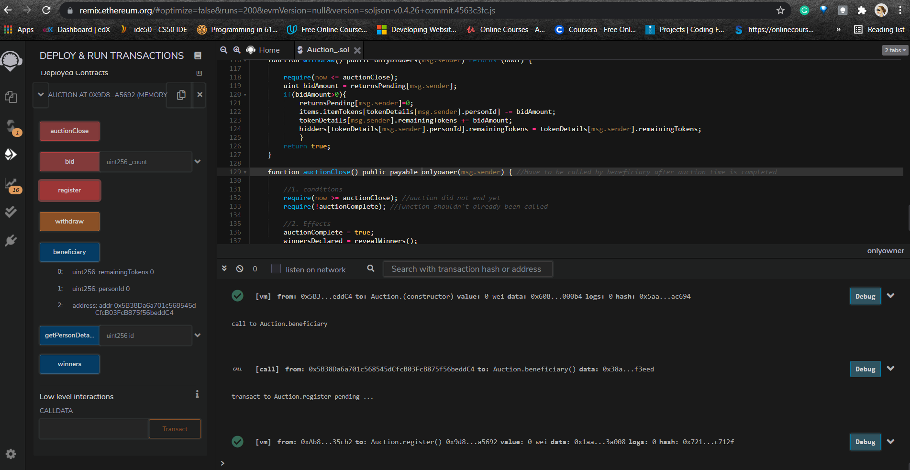
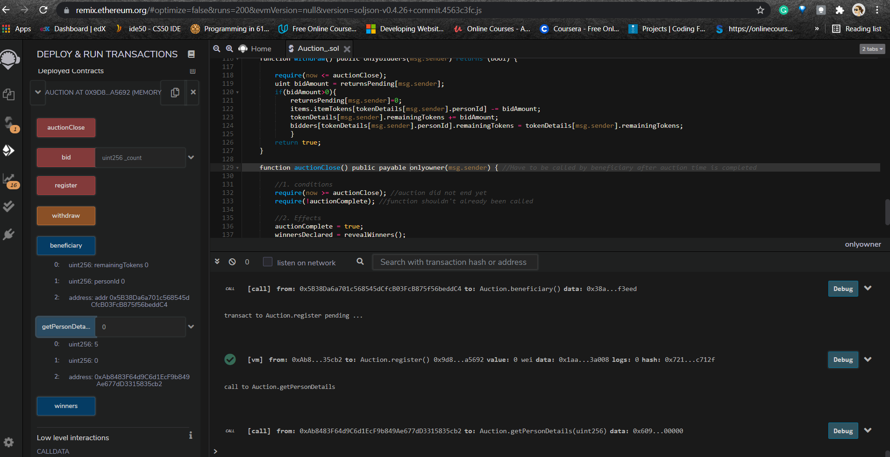
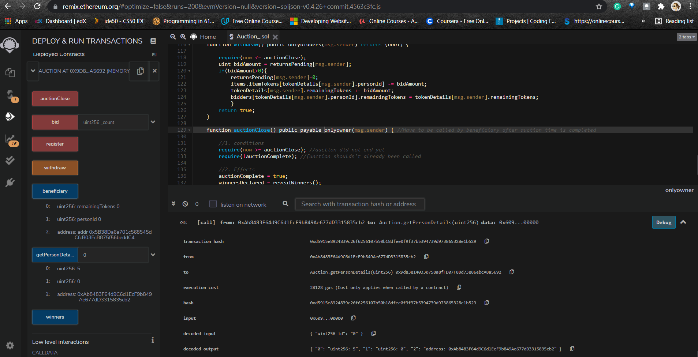
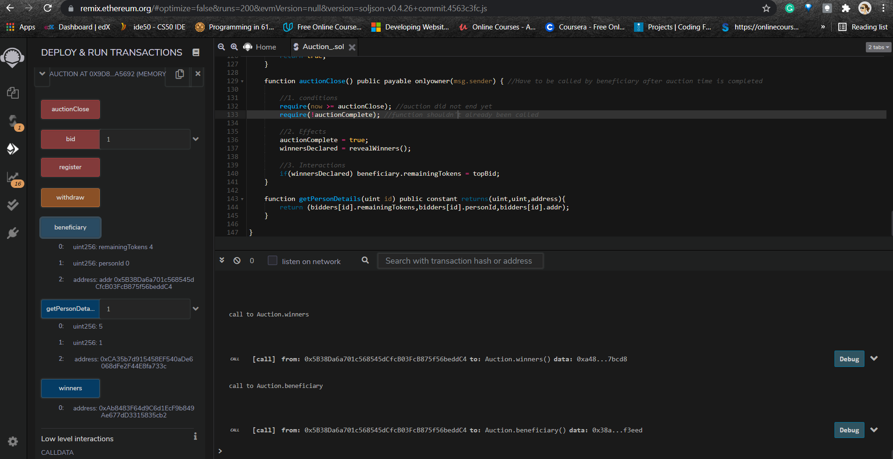
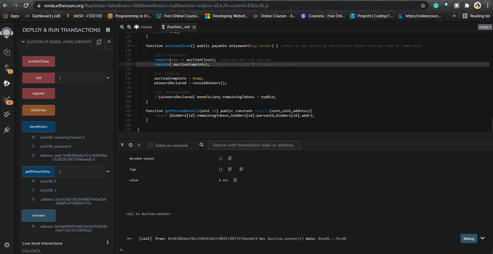

# Blockchain-Based-E-Auction-using-Smart-Contract

Smart contracts use blockchain technology to verify, validate, capture and enforce agreed-upon terms between multiple parties. Smart contracts on the blockchain allow for transactions and agreements to be carried out among anonymous parties without the need for a central entity, external enforcement, or legal system. It is built using the programming language, Solidity. The bytecode of smart contract redeemed with JSON format is utilized for broadcasting all the nodes of blockchain and then wait for verifying. If it is true, the contract is with individual contract address and JSON interface to allow the other person to get in. 
 
As for the contract, we define the functions below:<br><br>
```
(1) blindAuction()
```
Activate the contract by calling this function, and use the auctionStart and biddingEnd to record the start and end time.<br>
```
(2) Bid()
```
This function can be called by anyone to initialize the bidding action. Before the function is executed, AuctionStart and biddingTime are used to judge whether the contract is expired. If not, the bidder can send the bid envelope if the price is greater than the current highest price. The contract system will use highestBid and highestBidder to record the current highest price and the corresponding bidder’s address.<br>
```
(3) revealwinners()
```
Checks and compares the prices of all the tickets to attain the final winner when the Auction is closed.<br>
```
(4) AuctionClose()
```
In this function, AuctionStart and biddingTime are automatically used to compute the contract validity time. If the effective time ends, the successful bidder’s Address and the current highest price will be automatically sent to the tenderer. This function will be disabled to avoid repeated execution.<br>
```
(5) withdraw()
```
Returns the number of bids tendered by bidders other than the successful bidder.<br><br>

Below are few screenshots of transactions performed using the Remix IDE:<br><br>

1. Register current account in the chosen environment.<br><br>
<br><br>
2. Show registered account details<br><br>
<br><br>
3. Overview of a transaction<br><br>
<br><br>
4. Beneficiary details<br><br>
<br><br>
5. Auction winner details after auction close<br><br>
<br><br>
